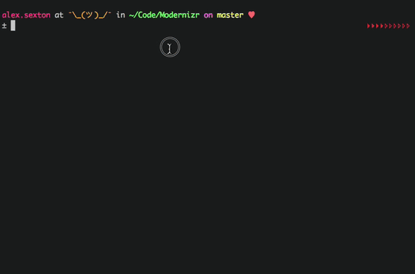
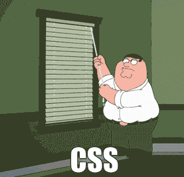
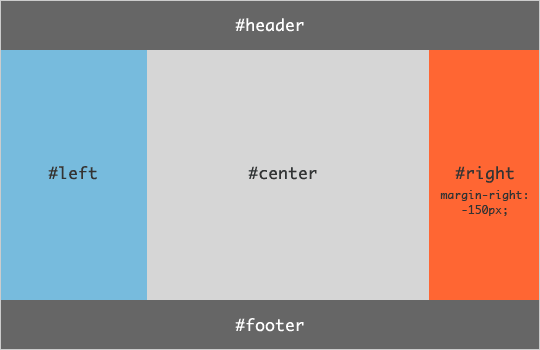
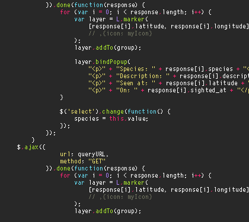

<!-- backgroundColor: #393D3F -->
<!-- color: #D7FFF1-->

# WDI 900-Hour Course
# At Code Immersives

---

### Module 1
### Terminal, Workflow, And Web App Structure

* Workflow and Text Editing, VS Code Fundamentals
* Intro to Markdown
* Web Technology Basics

---

### Module 2
### Core Language and Browser Intro

* Running JavaScript in the Browser and in Node
* Basic JavaScript - Variables, Arrays, Functions
* Intermediate Level Web UI - HTML and CSS
* Creating a Simple Browser-Based Application

---

### Module 3
### Responsive Design and Intermediate Language

* Responsive Layouts with Media Queries, Flexbox, and Grid
* Data Logic
* Intermediate Level Web Apps

---

### Module 4
### Advanced JavaScript and Intro to Frameworks

* Object-Oriented Programming
* Data Structures and Preliminary Data Storage
* Capstone Web App
